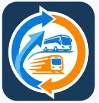

<h1 align="center">
  

🚇 바로 타 (BaroTa)</h1>
<p align="center">
  
  
  
  


> 지하철, 버스, 따릉이 정보를 한 번에 확인할 수 있는 통합 대중교통 서비스

## 📌 프로젝트 소개

<strong>바로 타</strong> 는 사용자가 검색한 역을 기준으로 실시간 지하철 정보, 주변 따릉이 대여소 정보, 버스 정보를 한 화면에서 제공하는 교통 정보 서비스입니다.

기존에는 지하철, 버스, 자전거 정보를 각각 다른 서비스에서 확인해야 했지만, 바로 타는 이를 하나의 플랫폼으로 통합하여 사용자의 이동 편의성을 높이는 것을 목표로 개발되었습니다.

---

## 🎯 주요 기능

### 🚇 실시간 지하철 정보

* 서울시 실시간 지하철 도착 정보 제공
* 호선별 필터링 기능
* 급행 / 일반 열차 구분
* 도착 예정 시간 표시

### 🚲 따릉이 정보

* 주변 따릉이 대여소 조회
* 대여 가능 자전거 수 확인
* 현재 위치 기준 거리 표시
* 지도 마커 및 상세 정보 제공

### 🚌 버스 정보

* 주변 버스 정류장 위치 정보 제공
* 간선 / 지선 / 광역 / 공항 / 마을버스 구분
* 버스 도착 정보 표시

### 🗺 지도 서비스

* 카카오맵 기반 지도 제공
* 역 검색 기능
* 현재 위치 기반 주변 역 탐색
* 따릉이 위치 시각화

### 📍 현재 위치 서비스

* Geolocation API 활용
* 현재 위치 기반 주변 역 자동 검색

---

## 🛠 기술 스택

### Front-End

* React
* JavaScript (ES6+)
* CSS3
* Vite

### Library

* Axios
* react-kakao-maps-sdk
* Lucide React

### Open API

* 서울시 실시간 지하철 도착 정보 API
* 서울시 따릉이 API
* Kakao Map API
* Geolocation API

---

## 📂 프로젝트 구조

```plaintext
src
 ┣ components
 ┃ ┣ Header.jsx
 ┃ ┣ InfoPanel.jsx
 ┃ ┣ SubwayPanel.jsx
 ┃ ┣ BusPanel.jsx
 ┃ ┣ BikePanel.jsx
 ┃ ┗ MapSection.jsx
 ┣ services
 ┃ ┣ subwayApi.js
 ┃ ┣ bikeApi.js
 ┃ ┗ busApi.js
 ┣ assets
 ┣ App.jsx
 ┗ main.jsx
```

---

## ⚙ 실행 방법

```bash
npm install
npm run dev
```

---

## 💡 개발 과정에서 배운 점

* React 컴포넌트 기반 설계 경험
* Props와 State를 활용한 데이터 관리
* Open API 연동 및 비동기 처리
* 지도 API 활용
* 사용자 중심 UI 설계

특히 API 연동 과정에서 인증 오류와 데이터 처리 문제를 해결하며 공식 문서를 분석하고 문제를 해결하는 능력을 향상시킬 수 있었습니다.

---

## 🚀 향후 개선 계획

* 실제 버스 API 연동
* 사용자 즐겨찾기 기능
* 실시간 알림 기능
* 경로 찾기 기능

```javascript
if (opportunity) {
  improveBusAPI();
  buildBackend();
  deployService();
}
```

> 기회가 있다면 실제 서비스 수준까지 발전시켜 보고 싶습니다.

</p>
